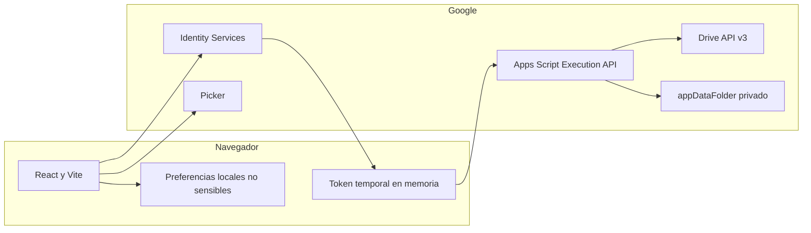
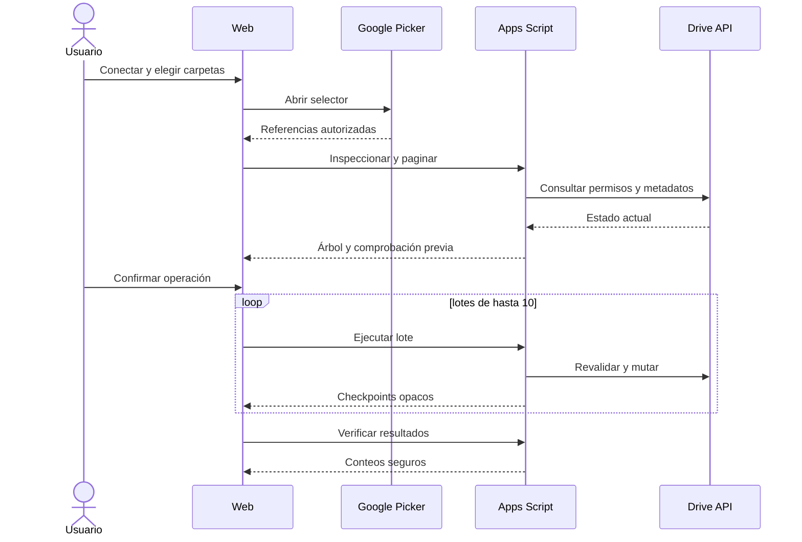
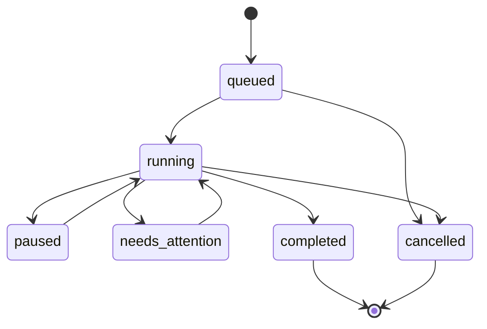
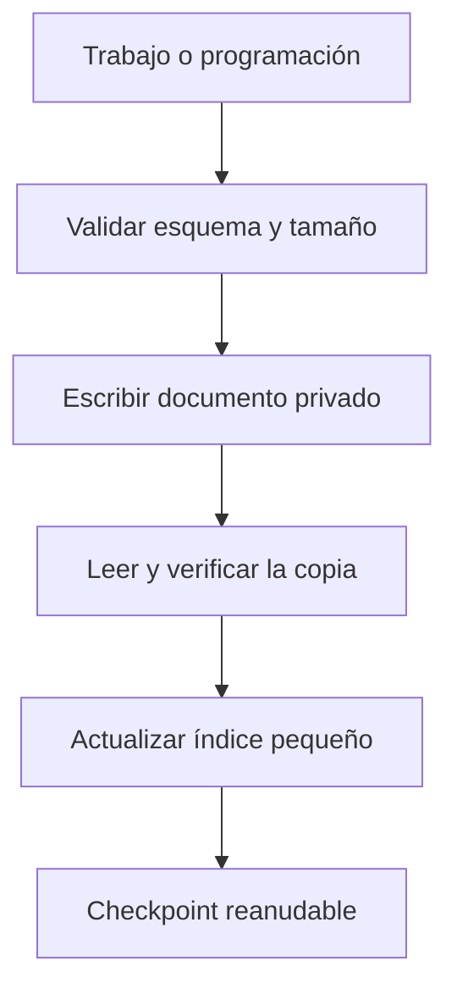

# Arquitectura de DriveTransfer

## Componentes

El frontend público no depende de `google.script.run`. Con autorización, llama a
`scripts.run` con el token en la cabecera `Authorization`. Apps Script ejecuta la
Drive API con la identidad y permisos de esa persona.

## Flujo de transferencia

## Validación y límites de confianza

El navegador prepara la experiencia, pero no es una autoridad. Apps Script
valida de nuevo IDs, nombres, MIME, tamaño conocido, padre, pertenencia al árbol,
espacio, permisos, capacidades, destino y ciclos. Se rechazan esquemas, estados,
identificadores y cargas fuera de los límites permitidos.

React representa nombres externos como texto. No hay HTML dinámico, `eval`,
carga de módulos proporcionados por usuarios ni ejecución de macros o bytes de
archivos. Drive realiza las copias y movimientos internamente.

## Idempotencia y recuperación

Cada operación usa una clave opaca en `appProperties`. Un reintento solo reutiliza
un resultado cuando la clave, el destino, el nombre, el tipo y el tamaño conocido
coinciden. Los trabajos guardan manifiesto, selección y checkpoints por separado.

Solo existe un trabajo activo por usuario. Los demás permanecen en cola y las
mutaciones usan `LockService.getUserLock()` para evitar carreras.

## Persistencia privada

No existe una base de datos pública. `appDataFolder` conserva documentos JSON
versionados y limitados a 450 KB. `UserProperties` mantiene únicamente índices
pequeños, versión de esquema y referencia al trigger. Todo queda aislado por la
cuenta de Google conectada.

El historial se conserva durante 90 días. Los trabajos reanudables caducan a los
7 días. La eliminación borra exclusivamente documentos, índices y triggers de
DriveTransfer; no toca originales, copias ni destinos.

## Programaciones

Un único dispatcher periódico por usuario reclama trabajos con lock. Las
programaciones admiten copia o sincronización conservadora, nunca movimiento.
Los archivos modificados generan una versión fechada y una desaparición en el
origen no provoca borrado en el destino.

## OAuth y permisos

El acceso a subárboles arbitrarios requiere el permiso restringido
`https://www.googleapis.com/auth/drive`. La apertura general permanece
condicionada a la verificación de Google y a cualquier evaluación adicional que
solicite. El token no se guarda en URLs, almacenamiento persistente, errores ni
telemetría.
