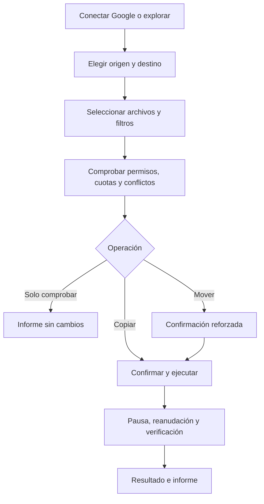

# Resumen de producto

## Propósito

DriveTransfer reduce el trabajo manual al organizar archivos entre carpetas de
Google Drive. Reúne selección, comprobación previa, detección de conflictos,
ejecución por lotes y resultados en un flujo controlado.

El repositorio es una recreación técnica personal desarrollada desde cero. No
contiene código, documentos, datos, estructuras, métricas, procedimientos ni
activos de empleadores, clientes u otras organizaciones.

## Personas usuarias

- Personas que necesitan reorganizar un volumen elevado de archivos en Drive.
- Equipos que requieren revisar destino, permisos y duplicados antes de copiar.
- Usuarios de Google Workspace que trabajan con Mi unidad y unidades compartidas.

## Recorrido principal

## Principios del producto

- Copiar es la acción predeterminada; mover nunca está preseleccionado.
- Ninguna mutación ocurre sin una comprobación previa.
- No se reemplazan ni eliminan archivos existentes de forma silenciosa.
- Los reintentos conservan lo ya completado y evitan duplicados.
- Las sincronizaciones añaden contenido o versiones fechadas, pero no borran.
- Los datos del modo exploración son exclusivamente ficticios.
- Los tokens, nombres e identificadores privados no se registran.

## Criterios de aceptación

- Flujo completo en modo exploración y con una cuenta de desarrollo.
- Mi unidad y unidades compartidas en ambas direcciones.
- Árboles grandes con selección parcial, filtros y virtualización.
- Errores parciales, cuotas, permisos y sesiones caducadas comprensibles.
- Interfaz accesible y adaptable en móvil, tableta y escritorio.
- Pruebas automáticas de planificación, idempotencia, seguridad y recuperación.
