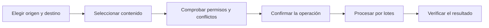

# DriveTransfer

**Transferencias y automatizaciones seguras para Google Drive**

[](https://github.com/antoniojesusdelgado/drivetransfer/releases/latest)
[](https://github.com/antoniojesusdelgado/drivetransfer/actions/workflows/quality.yml)
[](https://github.com/antoniojesusdelgado/drivetransfer/actions/workflows/codeql.yml)


DriveTransfer permite seleccionar, revisar y transferir archivos entre carpetas
de Google Drive con una comprobación obligatoria antes de cada cambio. Funciona
con Mi unidad y unidades compartidas, conserva la copia como opción
predeterminada y exige una confirmación adicional para mover.

[Abrir DriveTransfer](https://drivetransfer.app) ·
[Ver el caso en el portfolio](https://antoniodelgado.tech/proyectos/drivetransfer) ·
[Consultar la última versión](https://github.com/antoniojesusdelgado/drivetransfer/releases/latest)


## Visión general

|                         |                                                                                                                                                   |
| ----------------------- | ------------------------------------------------------------------------------------------------------------------------------------------------- |
| **Necesidad**           | Organizar documentación en Drive sin perder el control sobre permisos, duplicados, destino y progreso.                                            |
| **Respuesta**           | Un flujo guiado que separa selección, comprobación, confirmación, ejecución y resultado.                                                          |
| **Alcance**             | Mi unidad, unidades compartidas, copia, movimiento confirmado, sincronización conservadora, trabajos reanudables y programaciones.                |
| **Estado**              | Versión `1.0.2` publicada. El modo exploración es público; el acceso general con Google depende de la verificación de sus permisos restringidos. |

Es un proyecto personal, gratuito y no comercial de portfolio. El código, las
pruebas y las capturas públicas utilizan contenido ficticio o anonimizado. No
está afiliado, patrocinado ni aprobado por Google ni por terceros.

## Aportación del proyecto

- **Análisis funcional:** convierte una operación sensible en un recorrido con
  reglas explícitas, estados comprensibles y confirmaciones proporcionales al
  riesgo.
- **Diseño de producto:** reúne selección, conflictos, seguimiento,
  programaciones e historial en una experiencia coherente, accesible y
  adaptable.
- **Ingeniería full stack:** integra React, Google Identity Services, Google
  Picker, Apps Script y Drive API v3 detrás de contratos tipados.
- **Seguridad y privacidad:** limita la confianza en el navegador, revalida cada
  mutación, mantiene los tokens en memoria y aísla los datos privados por
  usuario.
- **Calidad de entrega:** incorpora pruebas automatizadas, builds separados,
  auditoría de dependencias, CodeQL y evidencias de validación funcional, visual
  y de seguridad.

## Capacidades principales

- Acceso mediante Google Identity Services y selección con Google Picker.
- Recorrido completo de exploración sin iniciar sesión.
- Árbol virtualizado, búsqueda, filtros y selección masiva.
- Detección y resolución explícita de conflictos, sin sustituciones silenciosas.
- Modo «Solo comprobar», copia, movimiento confirmado y sincronización
  unidireccional conservadora.
- Cola con un único trabajo activo, pausa, cancelación, reanudación y reintentos.
- Favoritos, programaciones e historial privado durante 90 días.
- Informes JSON y CSV sin identificadores internos ni fórmulas ejecutables.
- Eliminación de los datos de DriveTransfer sin borrar originales ni archivos
  ya transferidos.

## Recorrido funcional



La copia es la opción predeterminada. Mover requiere una confirmación reforzada
y las sincronizaciones nunca eliminan contenido del destino.

## Arquitectura


El navegador prepara la operación, pero no actúa como fuente de confianza.
Apps Script vuelve a consultar Drive y revalida permisos, capacidades,
metadatos, rutas y límites antes de cada mutación. DriveTransfer no descarga ni
ejecuta los bytes de los documentos.

### Decisiones de diseño

1. **Seguridad antes de mutar.** Toda operación pasa por una comprobación previa
   y por una segunda validación en Apps Script.
2. **Recuperación sin duplicados.** Los lotes utilizan claves opacas,
   idempotencia y puntos de control reanudables.
3. **Errores parciales explícitos.** Un fallo detiene nuevas acciones cuando
   corresponde, conserva el origen y comunica qué se completó.
4. **Persistencia mínima y privada.** El token vive solo en memoria y los
   documentos de trabajo se guardan en `appDataFolder`, aislados por cuenta.
5. **Escalabilidad dentro de cuotas.** Las lecturas se paginan y las mutaciones
   se procesan en lotes pequeños con límites por usuario y globales.

Consulta [Arquitectura](ARCHITECTURE.md), [Seguridad](SECURITY.md) y
[Configuración](DEPLOYMENT.md) para el detalle técnico.

## Tecnologías

| Capa         | Tecnologías                                                                     |
| ------------ | ------------------------------------------------------------------------------- |
| Interfaz     | React 19, TypeScript, Vite, DM Sans, DM Serif Display y Phosphor Icons          |
| Google       | Google Identity Services, Google Picker, Apps Script y Drive API v3            |
| Persistencia | `appDataFolder`, `UserProperties`, `LockService` y activadores de Apps Script  |
| Calidad      | ESLint, Prettier, Vitest, GitHub Actions, CodeQL y Dependabot                   |
| Publicación  | Vercel, dominio propio, HTTPS y cabeceras de seguridad                          |

## Estructura del repositorio

```text
src/
  domain/          Reglas de selección, planificación, filtros y ejecución
  explore/         Recorrido público con contenido ficticio
  integrations/    OAuth, Picker y gateway de Apps Script
  ui/              Componentes, vistas y controles de privacidad
apps-script/src/   Validación, Drive API, trabajos y persistencia privada
tests/             Pruebas unitarias, de contrato, seguridad y grandes volúmenes
artifacts/         Evidencias visuales finales con contenido ficticio
```

## Desarrollo local

Requisitos: Node.js 24 y npm 11, o versiones compatibles.

```powershell
npm install
Copy-Item .env.example .env.local
npm run dev
```

Las variables `VITE_*` se incorporan al cliente y no deben contener secretos.
La clave de API debe limitarse a los orígenes previstos y exclusivamente a
Google Picker API. Sin configuración de Google, el modo exploración continúa
disponible.

## Validación

```powershell
npm run format
npm run lint
npm run typecheck
npm test
npm run build
npm audit --audit-level=moderate
```

La estrategia y las últimas evidencias están documentadas en
[Validación funcional](functional-qa.md),
[Seguridad y sistema](security-qa.md) y
[Diseño adaptable](design-qa.md).

## Documentación

| Documento                                    | Contenido                                                  |
| -------------------------------------------- | ---------------------------------------------------------- |
| [Resumen de producto](PROJECT_BRIEF.md)      | Propósito, recorrido, principios y criterios de aceptación |
| [Arquitectura](ARCHITECTURE.md)              | Componentes, flujos, persistencia y recuperación           |
| [Seguridad](SECURITY.md)                     | Modelo de amenazas, controles y comunicación responsable   |
| [Configuración](DEPLOYMENT.md)               | Google Cloud, Apps Script, variables y pruebas manuales    |
| [Notas de versión](RELEASE_NOTES.md)         | Cambios y límites de la versión actual                     |
| [Avisos de terceros](THIRD_PARTY_NOTICES.md) | Marcas y recursos externos                                 |

Las políticas públicas están disponibles en
[Privacidad](https://drivetransfer.app/privacidad),
[Procedencia de los datos](https://drivetransfer.app/procedencia-datos),
[Aviso legal](https://drivetransfer.app/aviso-legal),
[Cookies](https://drivetransfer.app/cookies),
[Eliminar datos](https://drivetransfer.app/eliminar-datos) y
[Transparencia sobre IA](https://drivetransfer.app/transparencia-ia).

No incluyas tokens, credenciales, nombres reales, IDs de Drive ni documentos
privados en incidencias, pruebas o capturas.

## Derechos

Copyright © 2026 Antonio Jesús Delgado Briones. Todos los derechos reservados.

Este repositorio es público para consulta profesional, pero no incluye una
licencia de software ni concede permiso de uso, modificación o redistribución.
Consulta [COPYRIGHT.md](COPYRIGHT.md).
