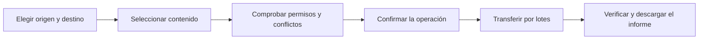
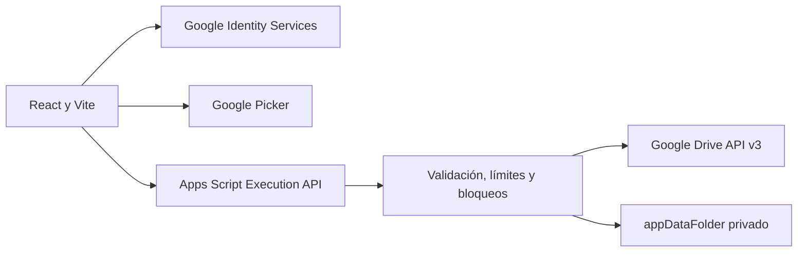

# DriveTransfer

**Versión 1.0.3** · [drivetransfer.app](https://drivetransfer.app)

[](https://github.com/antoniojesusdelgado/drivetransfer/releases/latest)
[](https://github.com/antoniojesusdelgado/drivetransfer/actions/workflows/quality.yml)
[](https://github.com/antoniojesusdelgado/drivetransfer/actions/workflows/codeql.yml)


Herramienta web para seleccionar, revisar y transferir archivos entre carpetas
de Google Drive con control previo de permisos y conflictos.

[Probar DriveTransfer](https://drivetransfer.app) ·
[Ver el caso profesional](https://antoniodelgado.tech/proyectos/drivetransfer) ·
[Ver la última versión](https://github.com/antoniojesusdelgado/drivetransfer/releases/latest) ·
[Consultar seguridad](SECURITY.md) · [Configurar el proyecto](DEPLOYMENT.md)


## Proyecto

### Necesidad

El proyecto original nació de una necesidad documental de Fundación
Cibervoluntarios: revisar y trasladar archivos entre carpetas de Google Drive
con mayor control sobre la selección, los permisos y los posibles duplicados.

### Intervención

Como Analista Funcional, analicé la necesidad, recogí requisitos y realicé el
diseño, el desarrollo, las pruebas y la implantación de CopyDrive. Después
evolucioné ese aprendizaje como un producto web público e independiente.

### Solución

DriveTransfer permite elegir origen y destino, revisar el contenido antes de
actuar y ejecutar operaciones por lotes. La copia es la opción predeterminada;
mover exige una confirmación adicional y las sincronizaciones nunca eliminan
contenido del destino.

### Evidencia

La aplicación pública puede utilizarse en modo exploración sin iniciar sesión.
También admite Google Identity Services y Google Picker para trabajar con Mi
unidad y unidades compartidas dentro de los permisos concedidos por la persona
usuaria.

## Funciones principales

- OAuth mediante Google Identity Services y selección con Google Picker.
- Exploración completa sin iniciar sesión.
- Árbol accesible, búsqueda, filtros y selección masiva.
- Detección y resolución explícita de conflictos, sin sustituciones silenciosas.
- Modo «Solo comprobar», copia, movimiento confirmado y sincronización
  conservadora.
- Trabajos reanudables, cola, pausa, cancelación, reintentos e informes seguros.
- Favoritos, programaciones e historial privado durante 90 días.
- Eliminación de los datos de DriveTransfer sin borrar los archivos transferidos.

## Cómo funciona



La herramienta separa la exploración, la selección, la detección de duplicados,
la ejecución y el informe final. Antes de cualquier cambio muestra una vista
previa y vuelve a validar permisos, metadatos y límites.

## Arquitectura resumida



El token OAuth permanece únicamente en memoria. El navegador llama directamente
a `scripts.run`; Apps Script vuelve a consultar Drive y revalida permisos,
capacidades, metadatos, rutas y límites antes de cada mutación. DriveTransfer no
descarga ni ejecuta los bytes de los documentos.

## Desarrollo asistido con inteligencia artificial

DriveTransfer se ha desarrollado mediante programación asistida con ChatGPT
Codex, bajo dirección, revisión y validación humana. Esta asistencia forma parte
del proceso de desarrollo, no de las funciones del producto.

La aplicación no utiliza modelos de inteligencia artificial para seleccionar,
copiar, mover o sincronizar archivos. El alcance se explica en
[Transparencia sobre IA](https://drivetransfer.app/transparencia-ia).

## Privacidad y alcance público

Este repositorio recoge una evolución pública independiente de la herramienta
interna y no contiene su código, datos, documentos, credenciales, identificadores
de Drive o procedimientos internos. La mención de la organización explica el
origen funcional del proyecto y no implica propiedad, patrocinio, afiliación o
respaldo sobre esta implementación pública.

Todos los ejemplos, pruebas y capturas públicas emplean datos ficticios. La
información pública está disponible en [Privacidad](https://drivetransfer.app/privacidad),
[Procedencia de los datos](https://drivetransfer.app/procedencia-datos),
[Aviso legal](https://drivetransfer.app/aviso-legal),
[Cookies](https://drivetransfer.app/cookies) y
[Eliminar datos](https://drivetransfer.app/eliminar-datos).

Google Analytics y Vercel Web Analytics permanecen desactivados hasta que la
persona usuaria acepta expresamente la analítica desde las preferencias de
privacidad.

Es un proyecto personal, gratuito y no comercial. No está afiliado, patrocinado
ni aprobado por Google, empleadores o clientes.

No incluyas tokens, credenciales, nombres reales, IDs de Drive ni documentos
privados en incidencias, pruebas o capturas.

## Desarrollo local

Requisitos: Node.js 24 y npm 11, o versiones compatibles.

```powershell
npm install
Copy-Item .env.example .env.local
npm run dev
```

Las variables `VITE_*` se integran en el cliente y no deben contener secretos.
La clave de API debe estar restringida por origen y exclusivamente a Google
Picker API. Sin configuración de Google, el modo exploración continúa
disponible.

## Validación

```powershell
npm run format
npm run lint
npm run typecheck
npm test
npm run build
npm audit --audit-level=moderate
```

## Documentación

- [Arquitectura](ARCHITECTURE.md)
- [Pruebas funcionales](functional-qa.md)
- [Seguridad y sistema](security-qa.md)
- [Diseño adaptable](design-qa.md)
- [Despliegue](DEPLOYMENT.md)
- [Seguridad](SECURITY.md)
- [Derechos de autor](COPYRIGHT.md)

## Derechos

Copyright © 2026 Antonio Jesús Delgado Briones. Todos los derechos reservados.

Este repositorio no incluye una licencia de software y no concede permiso para
usar, copiar, modificar, distribuir o crear obras derivadas del código. Al ser
público, GitHub permite visualizarlo y bifurcarlo conforme a sus propias
condiciones, sin que ello otorgue una licencia adicional. Consulta
[COPYRIGHT.md](COPYRIGHT.md).
