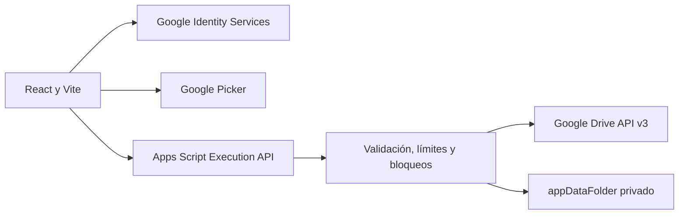

# DriveTransfer

**Versión 1.0.1** · [drivetransfer.app](https://drivetransfer.app)

DriveTransfer permite elegir, revisar y transferir archivos entre carpetas de
Google Drive con una vista previa obligatoria. Funciona con Mi unidad y unidades
compartidas, mantiene la copia como opción predeterminada y exige una
confirmación adicional para mover.

Es un proyecto personal, gratuito y no comercial de portfolio. Todos los
ejemplos, pruebas y capturas públicas emplean datos ficticios. No está afiliado,
patrocinado ni aprobado por Google ni por empleadores o clientes.

## Funciones principales

- OAuth mediante Google Identity Services y selección con Google Picker.
- Exploración completa sin iniciar sesión.
- Árbol accesible, búsqueda, filtros y selección masiva.
- Detección y resolución explícita de conflictos, sin sustituciones silenciosas.
- Modo «Solo comprobar», copia, movimiento confirmado y sincronización
  conservadora.
- Trabajos reanudables, cola, pausa, cancelación, reintentos e informes seguros.
- Favoritos, programaciones e historial privado durante 90 días.
- Eliminación de los datos de DriveTransfer sin borrar los archivos transferidos.

## Arquitectura resumida



El token OAuth permanece únicamente en memoria. El navegador llama directamente
a `scripts.run`; Apps Script vuelve a consultar Drive y revalida permisos,
capacidades, metadatos, rutas y límites antes de cada mutación. DriveTransfer no
descarga ni ejecuta los bytes de los documentos.

Consulta [Arquitectura](ARCHITECTURE.md), [Seguridad](SECURITY.md) y
[Despliegue](DEPLOYMENT.md) para el detalle técnico.

## Desarrollo local

Requisitos: Node.js 24 y npm 11 o versiones compatibles.

```powershell
npm install
Copy-Item .env.example .env.local
npm run dev
```

Las variables `VITE_*` se integran en el cliente y no deben contener secretos.
La API key debe estar restringida por origen y exclusivamente a Google Picker
API. Sin configuración de Google, el modo exploración continúa disponible.

## Validación

```powershell
npm run format
npm run lint
npm run typecheck
npm test
npm run build
npm audit --audit-level=moderate
```

La estrategia completa está en [Pruebas funcionales](functional-qa.md),
[Seguridad y sistema](security-qa.md) y [Diseño responsive](design-qa.md).

## Privacidad y transparencia

La información pública está disponible en
[Privacidad](https://drivetransfer.app/privacidad),
[Procedencia de los datos](https://drivetransfer.app/procedencia-datos),
[Aviso legal](https://drivetransfer.app/aviso-legal),
[Cookies](https://drivetransfer.app/cookies),
[Eliminar datos](https://drivetransfer.app/eliminar-datos) y
[Transparencia sobre IA](https://drivetransfer.app/transparencia-ia).

No incluyas tokens, credenciales, nombres reales, IDs de Drive ni documentos
privados en incidencias, pruebas o capturas.

## Derechos

Copyright © 2026 Antonio Jesús Delgado Briones. Todos los derechos reservados.

Este repositorio no incluye una licencia de software y no concede permiso para
usar, copiar, modificar, distribuir o crear obras derivadas del código. Al ser
público, GitHub permite visualizarlo y bifurcarlo conforme a sus propias
condiciones, sin que ello otorgue una licencia adicional. Consulta
[COPYRIGHT.md](COPYRIGHT.md).
