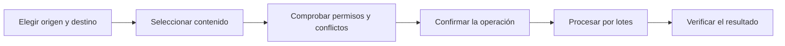

# DriveTransfer

**Transferencias y automatizaciones seguras para Google Drive**

[](https://github.com/antoniojesusdelgado/drivetransfer/releases/latest)
[](https://github.com/antoniojesusdelgado/drivetransfer/actions/workflows/quality.yml)
[](https://github.com/antoniojesusdelgado/drivetransfer/actions/workflows/codeql.yml)


Herramienta web para seleccionar, revisar y transferir archivos entre carpetas de Google Drive. Funciona con Mi unidad y unidades compartidas, conserva la copia como opción predeterminada y exige una confirmación adicional para mover.

[Abrir DriveTransfer](https://drivetransfer.app) · [Ver el caso en el portfolio](https://antoniodelgado.tech/proyectos/drivetransfer) · [Consultar la última versión](https://github.com/antoniojesusdelgado/drivetransfer/releases/latest)

[](https://drivetransfer.app)

## Visión general

| | |
| --- | --- |
| **Necesidad** | Preparar y transferir documentación de Google Drive sin perder el control sobre permisos, duplicados, destino y progreso. |
| **Aportación** | Análisis del flujo, toma de requisitos, definición funcional, desarrollo, pruebas e implantación. |
| **Solución** | Un recorrido guiado que separa selección, comprobación, confirmación, ejecución y resultado. |
| **Evidencia** | Aplicación pública recorrible, caso profesional, código, documentación, releases y comprobaciones automatizadas. |

El proyecto original responde a una necesidad documental real de Fundación Cibervoluntarios. Este repositorio contiene una evolución pública posterior e independiente, construida con información sintética y sin conexiones con los sistemas internos; la referencia no implica patrocinio o respaldo.

## Aportación profesional

- **Análisis funcional:** convierte una operación sensible en un recorrido con reglas, estados, excepciones y confirmaciones explícitas.
- **Coordinación de la solución:** conecta la necesidad documental con el diseño funcional, la integración técnica y la experiencia de uso.
- **Automatización de procesos:** reduce trabajo manual mediante lotes reanudables, resolución de conflictos y seguimiento de operaciones.
- **Validación:** pruebas de permisos, duplicados, fallos parciales, reintentos, accesibilidad, privacidad y seguridad.
- **Evolución del producto:** parte de una solución interna y transforma el aprendizaje en una herramienta pública, independiente y recorrible.

## Capacidades principales

- Acceso mediante Google Identity Services y selección con Google Picker.
- Recorrido completo de exploración sin iniciar sesión.
- Árbol accesible, búsqueda, filtros y selección masiva.
- Detección y resolución explícita de conflictos, sin sustituciones silenciosas.
- Modo «Solo comprobar», copia, movimiento confirmado y sincronización conservadora.
- Trabajos reanudables, cola, pausa, cancelación, reintentos e informes seguros.
- Favoritos, programaciones e historial privado durante 90 días.
- Eliminación de los datos de DriveTransfer sin borrar los archivos transferidos.

## Recorrido funcional



La copia es la opción predeterminada. Mover requiere una confirmación reforzada y las sincronizaciones nunca eliminan contenido del destino.

## Arquitectura


El navegador prepara la operación, pero Apps Script vuelve a consultar Drive y revalida permisos, capacidades, metadatos, rutas y límites antes de cada cambio. DriveTransfer no descarga ni ejecuta el contenido de los documentos.

Consulta [Arquitectura](ARCHITECTURE.md), [Seguridad](SECURITY.md) y [Configuración](DEPLOYMENT.md) para el detalle técnico.

## Tecnologías

| Capa | Tecnologías |
| --- | --- |
| Interfaz | React, TypeScript, Vite, DM Sans y Phosphor Icons |
| Google | Google Identity Services, Google Picker, Apps Script y Drive API v3 |
| Persistencia | appDataFolder, UserProperties, LockService y activadores de Apps Script |
| Calidad | ESLint, Prettier, Vitest, GitHub Actions, CodeQL y Dependabot |
| Publicación | Vercel, dominio propio, HTTPS y cabeceras de seguridad |

## Estructura del repositorio

```text
src/domain/        Reglas de selección, planificación y ejecución
src/explore/       Recorrido público con información sintética
src/integrations/  OAuth, Google Picker y gateway de Apps Script
src/ui/            Componentes, vistas y controles de privacidad
apps-script/src/   Validación, Drive API, trabajos y persistencia privada
tests/             Pruebas unitarias, de contrato y seguridad
artifacts/         Evidencias visuales con contenido ficticio
```

## Datos, privacidad y transparencia

La aplicación pública, las pruebas y las capturas utilizan exclusivamente información sintética o anonimizada. El repositorio no contiene tokens, credenciales, nombres reales, IDs de Drive, documentos privados ni procedimientos internos.

El token OAuth se mantiene en memoria, los datos de trabajo se aíslan por cuenta y cada operación se valida de nuevo antes de modificar contenido. DriveTransfer no está afiliado, patrocinado ni aprobado por Google ni por terceros.

El desarrollo se ha realizado con asistencia de Inteligencia Artificial bajo dirección, revisión y validación humana. La aplicación no utiliza modelos generativos para analizar o transferir documentos. El alcance se explica en [Transparencia sobre IA](https://drivetransfer.app/transparencia-ia).

## Desarrollo local

Requisitos: Node.js 24 y npm 11, o versiones compatibles.

```powershell
git clone https://github.com/antoniojesusdelgado/drivetransfer.git
Set-Location drivetransfer
npm install
Copy-Item .env.example .env.local
npm run dev
```

Las variables `VITE_*` se incorporan al cliente y no deben contener secretos. Sin configuración de Google, el modo exploración continúa disponible.

## Validación

```powershell
npm run format
npm run lint
npm run typecheck
npm test
npm run build
npm audit --audit-level=moderate
```

La estrategia y las evidencias están documentadas en [Validación funcional](functional-qa.md), [Seguridad y sistema](security-qa.md) y [Diseño adaptable](design-qa.md).

## Documentación

| Documento | Contenido |
| --- | --- |
| [Resumen de producto](PROJECT_BRIEF.md) | Propósito, recorrido y criterios de aceptación |
| [Arquitectura](ARCHITECTURE.md) | Componentes, flujos, persistencia y recuperación |
| [Seguridad](SECURITY.md) | Modelo de amenazas y comunicación responsable |
| [Configuración](DEPLOYMENT.md) | Google Cloud, Apps Script, variables y pruebas manuales |
| [Notas de versión](RELEASE_NOTES.md) | Cambios, estado y límites de la versión actual |
| [Avisos de terceros](THIRD_PARTY_NOTICES.md) | Marcas y recursos externos |

## Derechos

Copyright © 2026 Antonio Jesús Delgado Briones. Todos los derechos reservados.

El repositorio es público para consulta profesional, pero no concede permiso de uso, modificación o redistribución. Consulta [COPYRIGHT.md](COPYRIGHT.md) y [THIRD_PARTY_NOTICES.md](THIRD_PARTY_NOTICES.md).
